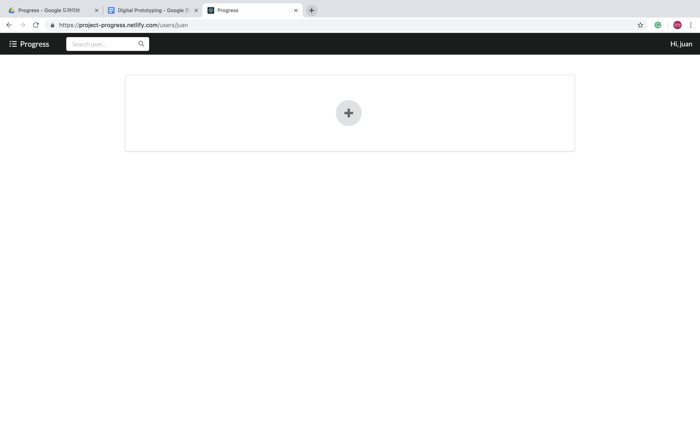

# Progress
**Boost/Boast your progress**

## Why Progress?
The visualized progress of the project has a very important role for the entire project. It motivates members, helps simulate the schedule, and even helps balance overall load for the project. However, it is difficult to start and manage the progress of the projects.

## We provide three Core Functions:
* Progress Add/Edit
  * Users can add task with due date, and sub-tasks for each task.
  * n tasks divide 100% into n equally, and m subtasks divide 100/n into m equally.
* Overviewing the progress
  * At the very beginning page, we an see all the projects' progress
* ~~Collaborating~~
  * ~~We can add collaborator, and it shows who did the task~~
  * Because this requires many undesirable efforts, I decided not to develop this function.

## Now, introduce Progress
If you want to see my digital prototype, just [click me!](https://www.figma.com/file/BfgjfxjE9kj0RuzGz6yykTzM/Progress?node-id=0%3A1)
You can see our prototype here: https://project-progress.netlify.com/

### When you enter the site, you need to **Sign In**!

> We provide very easy and direct sign in & sign up system.  
> Use *jsonstore.io* as remove DB  
> Communicate with *HTTP Request*

### Welcome to Progress, this is your *workspace*
You can add your project by clicking the + button

> fast-prototype with *[Semantic UI React](https://react.semantic-ui.com/)*

### Wow, this is your project.
Let's edit your project name, description, and add the tasks.  
In order to add tasks, click + button there.

### Finally, your progress is updated!
Whenever you finished your task, the progress is updated.

## How users think?
This is how users thought
1. Need to change the order of the project
2. Show the due date at the beginning page
3. If completed, please ~~strike~~ the project title
4. It would be better to show next task!

## Limitation & Future Works
* Create *Collaborating Function* if possible
* Performance Issue! Need refresh many times now
* Minor issue for user experience when adding the tasks

## Contributors
* [Juan Lee](https://github.com/sleepy-juan)